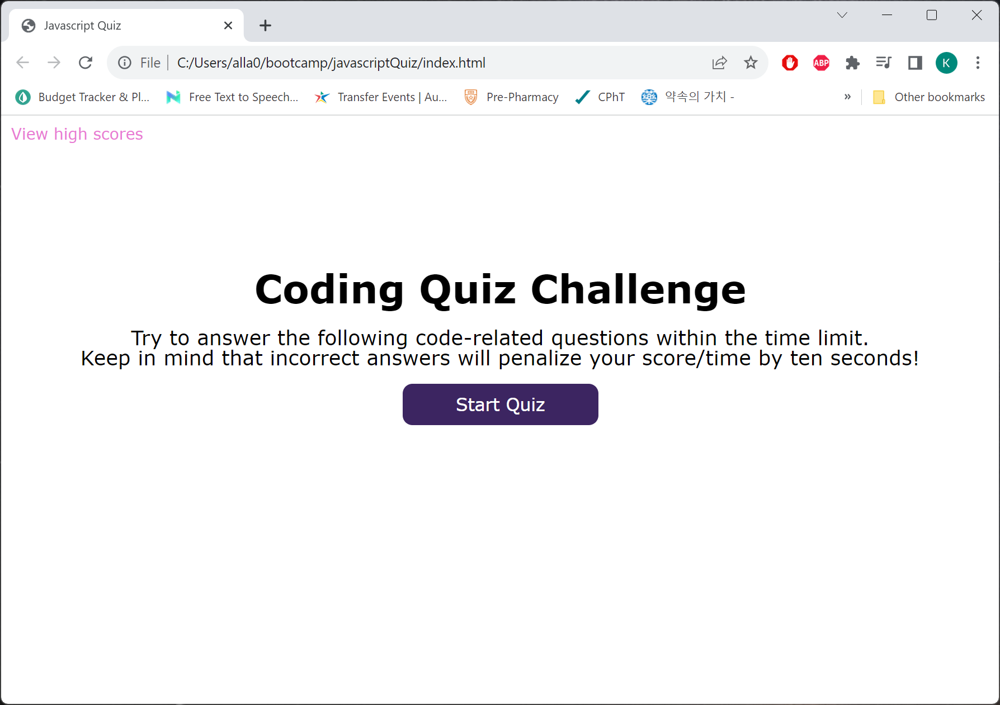
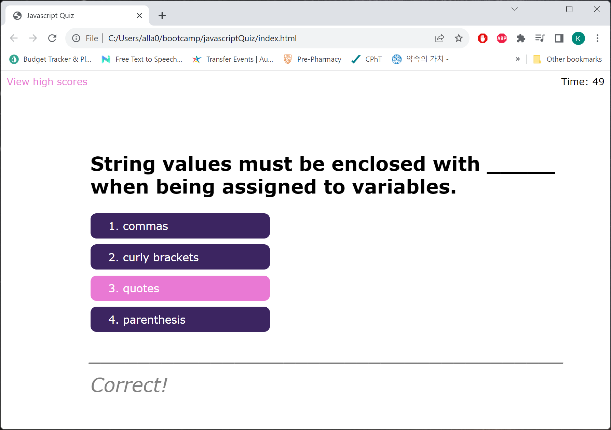
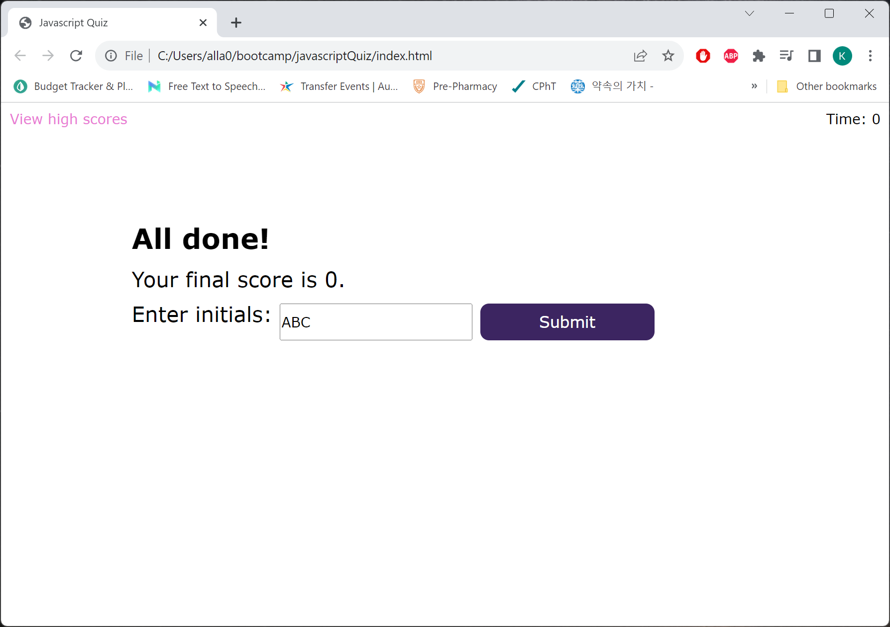
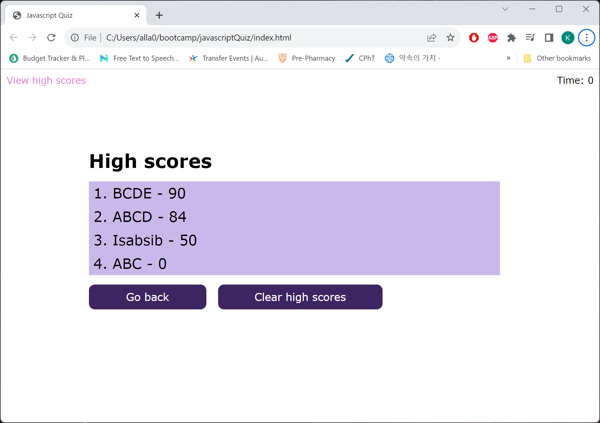

# Code_Quiz

  * Author: Kyosook Shin
  * Author's Email: kyosook.shin@gmail.com
  * Deployed URL: https://alla0810.github.io/javascriptQuiz/
  * GitHub: https://github.com/alla0810/javascriptQuiz
  * screenshot

## Source Code References
  This project has used some reference codes from the following sites

   * https://codingartistweb.com/2022/06/quiz-app-with-javascript/

   * https://git.bootcampcontent.com/University-of-Texas-at-Austin/UTA-VIRT-FSF-PT-07-2023-U-LOLC.git   

   
## User Story

AS A coding boot camp student
I WANT to take a timed quiz on JavaScript fundamentals that stores high scores 
SO THAT I can gauge my progress compared to my peers

## Acceptance Criteria

GIVEN I am taking a code quiz

* WHEN I click the start button, THEN a timer starts and I am presented with a question

* WHEN I answer a question, THEN I am presented with another question

* WHEN I answer a question incorrectly, THEN time is subtracted from the clock   
  ➨ How much subtraction? (-10 seconds) from the start page

* When the user answer correctly, THEN time is added by (+10 seconds)    
  ➨ Added by the author.  
  ➨ From the mock-up picture, sometimes the timer exceeds the initial value, which means there should be some addtion of timer value when the answer is correct as a prize.    

* When the user answer correctly, THEN time is added by (+10 seconds) 
  ➨ Added by the author.
  ➨ From the mock-up picture, sometimes the timer exceeds the initial value, which means there should be some addtion of timer value when the answer is correct as a prize.     

* WHEN all questions are answered or the timer reaches 0, THEN the game is over

* WHEN the game is over, THEN I can save my initials and score

## Mock-Up
The following animation demonstrates the application functionality

## Technical Acceptance Criteria: 40%

Satisfies all of the above acceptance criteria

## Deployment: 32%

* Application deployed at live URL.
* Application loads with no errors.
* Application GitHub URL submitted.
* GitHub repository that contains application code.

## Application Quality: 15%

* Application user experience is intuitive and easy to navigate
* Application user interface style is clean and polished.
* Application resembles the mock-up functionality provided in the Challenge instructions.

## Repository Quality: 13%

* Repository has a unique name.
* Repository follows best practices for file structure and naming conventions.
* Repository follows best practices for class/id naming conventions, indentation, high-quality comments, etc.
* Repository contains multiple descriptive commit messages.
* Repository contains a high-quality README file with description, screenshot, and link to deployed application.
